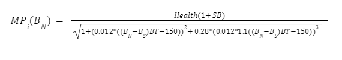

# ⚡ Bonding for mPower

Mining power, also known as MP, is a parameter assigned to each miner that reflects their ability to mine MXC blocks effectively. It takes into account factors such as the miner's hardware, experience, and efficiency, as well as their health and staking status. The higher a miner's mining power, the better they can compete with other miners in their tier.

The formula for calculating mining power takes into account the miner's age on the network, the current block number, the block number when the miner joined the network, the block time, staking boost, staking factor, and health. It is as follows:

Where:

* MP = Mining Power of the gateway
* Bn = Current Block Number
* Bs  = Block Number when the miner joined the network
* BT = Block Time (in Days)
* SB = Staking Boost
* SF = Staking Factor = 0,00002
* SC = Staking Cap = 1
* MXC = Staked (locked) MXC
* MD = Mining Difficulty
* ExpectedMXC = Expected mining per this particular miner

The mining difficulty is the measure of how difficult it is to find a new block in the blockchain network, ensuring the sustainability of the mining protocol for both present and future miners.&#x20;

.png>)

* AM = Total Active Miners

The formula includes two variables: "Pool" which represents the mining pool according to the tier that the miner belongs to, and  (1).png>) which is the sum of the total number of miners in the given pool including their individual mining power at a given block number (BN).

In other words, the formula "MD(BN)" calculates the mining difficulty for a given block number by taking into account the total mining power of all the miners in the pool, including the mining power of the individual miner.&#x20;

 (1).png>)

The above formula shows the ExpectedMXC mined according to the individual miner, and their respective Mining Difficulty by multiplying the Mining Power, and Mining Difficulty. MPi(BN) represents the mining power of the miner at block number BN, as calculated using the MD(BN) which represents the mining difficulty of the miner at block number BN.

The formula SB(MXC) stands for Staking Boost, MXC is the amount of MXC staked, where SF is the Staking Factor which is equal to 0.00002, SC the Staking Cap which is equal to 1.

.png>)

This formula is used to calculate the Staking Boost that a miner receives based on their staked MXC amount. The Staking Boost is a factor that increases the miner’s Mining Power, allowing them to increase their competitiveness within their respective tier.

Splitting up the formula, you can see that the first part, namely MXC \* SF calculates the potential Staking Boost based on the staked amount of MXC and the Staking Factor. The second part of the formula, MIN(), takes the minimum value between the potential Staking Boost and the Staking Cap. This ensures that the Staking Boost does not exceed the maximum value of 1.

As the formula suggests, the maximum staking amount is 50,000 MXC, which would grant the miner a boost of 2.&#x20;

For example, let’s say a miner has 10,000 MXC staked. Inserting this value into the formula, we get the following outcomes:

.png>)

The miner that has 10,000 MXC staked would receive a Staking Boost of 0.2, which would increase their Mining Power and allow them to perform more competitively within the tier.

In an example scenario in which there are 3 miners in Silver Tier, m1 with MP1 = 1, m2 with MP2 = 0.8 and m3 with MP3 = 0.2 and the tier has 10,000 MXC allocated to it. Then the miners may receive on average:

.png>)

In summary, the Mining Power (MP) of a miner in the MXC network plays a crucial role in determining their performance. A miner with a higher MP has a better chance of competing more effectively, while the MP is affected by various factors such as staking and health. The MXC tokens are allocated to each tier following the coefficient, and the allocation is distributed among the miners in proportion to their MP. Overall, MP is an essential metric that determines a miner's competitiveness and potential in the MXC network.

\
